<h2>TensorFlow-FlexUNet-Image-Segmentation-Prostate158-Prostate-Tumor-T2 (2026/03/26)</h2>
Sarah T. Arai 
Software Laboratory antillia.com  
This is the first experiment of Image Segmentation for <b>Prostate158 Prostate Tumor (2 classes)</b> based on 
our <a href="./src/TensorFlowFlexUNet.py">TensorFlowFlexUNet</a>
 (<b>TensorFlow Flexible UNet Image Segmentation Model for Multiclass</b>), and a 512x512 pixels PNG
 <a href="https://drive.google.com/file/d/1d1rYU9apf95QF_O43wFG3Mrz794i5GM2/view?usp=drive_link">
Augmented-Prostate158-T2-ImageMask-Dataset.zip</a> (RESTRICTED), which was derived by us from   
 <b>T2 subset </b> of 
<a href="https://zenodo.org/records/6481141">
<b>Prostate158 - Training data</b>
</a> on the zenodo.org
  

<b>Actual Image Segmentation for Prostate158-T2 Images of 512x512 pixels</b> 
As shown below, the inferred masks predicted by our segmentation model trained by the dataset appear similar to the ground truth masks.
  
<b>rgb_map = {anatomical zone:green, tumor:red} </b>
  
<table>
<tr>
<th>Input: image</th>
<th>Mask (ground_truth)</th>
<th>Prediction: inferred_mask</th>
</tr>
<tr>
<td>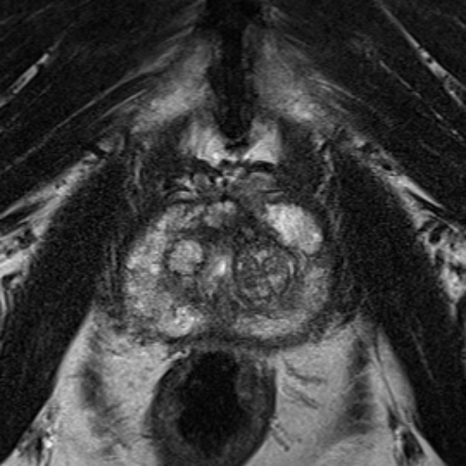</td>
<td>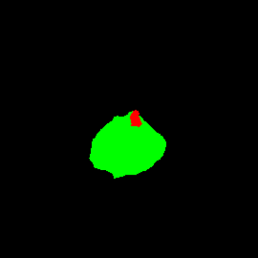</td>
<td>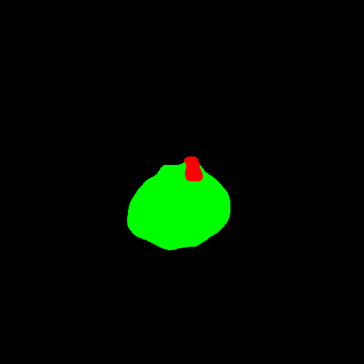</td>
</tr>

<tr>
<td>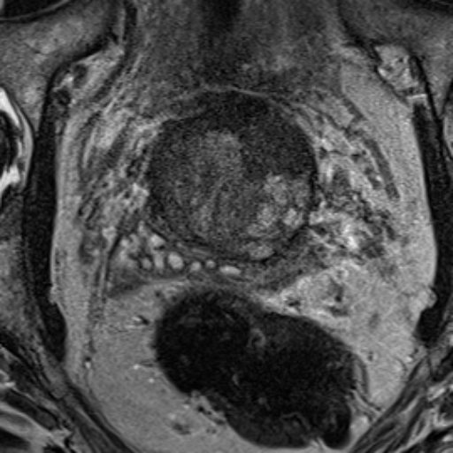</td>
<td>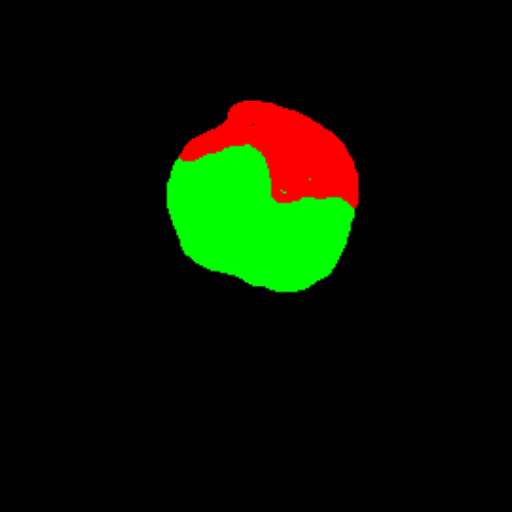</td>
<td>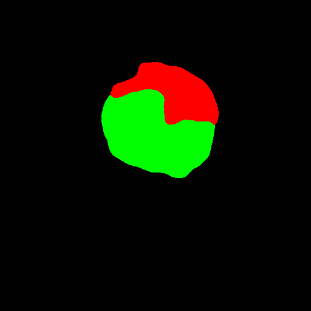</td>
</tr>

<tr>
<td>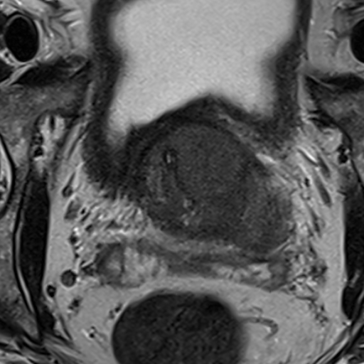</td>
<td>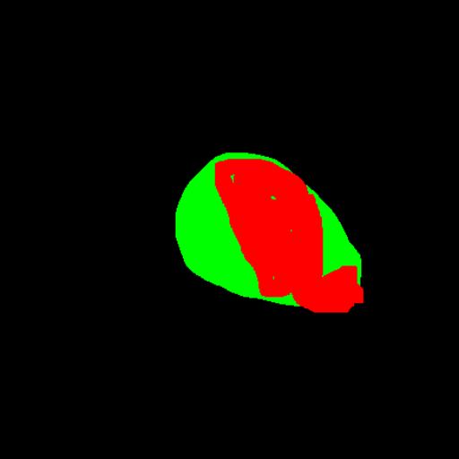</td>
<td>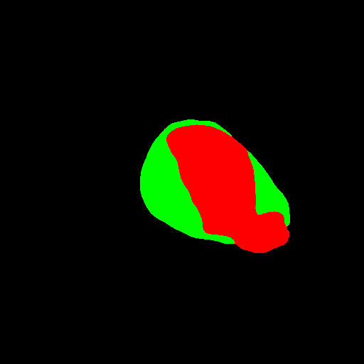</td>
</tr>
</table>

 
<h3>1 Dataset Citation</h3>
The dataset used here was taken from   
 <b>T2 subset </b> of 
<a href="https://zenodo.org/records/6481141">
<b>Prostate158 - Training data</b>
</a> on the zenodo.org
 
</a> on the zenodo web site.
The following explanation was taken from the zenodo web site 
  
<b>Keno Bressem, Lisa Adams, Günther Enge</b>  
<b>Citation</b> 
In Computers in Biology and Medicine (Version 1, Vol. 148, p. 105817). Zenodo. 
<a href="https://doi.org/10.5281/zenodo.6481141">https://doi.org/10.5281/zenodo.6481141</a>
  
For more information, please refer to 
<a href="https://www.sciencedirect.com/science/article/abs/pii/S0010482522005789">
Prostate158 - An expert-annotated 3T MRI dataset and algorithm for prostate cancer detection</a>
  
<b>License</b> 
Unknown
</a>
 
 
<h3>
2 Prostate158-T2 ImageMask Dataset
</h3>
 If you would like to train this Prostate158-T2 Segmentation model by yourself,
 please download the dataset from the google drive  
 <a href="https://drive.google.com/file/d/1d1rYU9apf95QF_O43wFG3Mrz794i5GM2/view?usp=drive_link">
Augmented-Prostate158-T2-ImageMask-Dataset.zip</a> (RESTRICTED)
, expand the downloaded ImageMaskDataset and put it under <b>./dataset</b> folder to be
 
<pre>
./dataset
└─Prostate158-T2
    ├─test
    │   ├─images
    │   └─masks
    ├─train
    │   ├─images
    │   └─masks
    └─valid
        ├─images
        └─masks
</pre>
 
<b>Prostate158-T2 Statistics</b> 
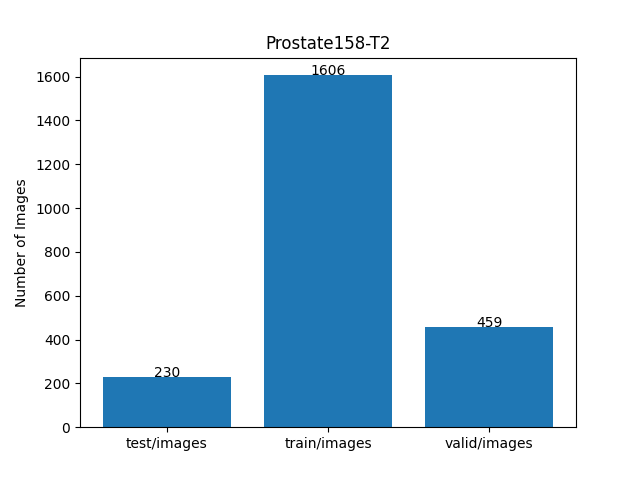 
 
As shown above, the number of images of train and valid datasets is not so large to use for the
 training set of our segmentation model.
 
 
We generated our augmented PNG dataset with colorized masks (<b>anatomical zone:green, tumor:red</b>) 
by using an offline augmentation tool <a href="./generator/ImageMaskDatasetGenerator.py">ImageMaskDatasetGenerator.py</a>
, which is based on our <a href="https://github.com/sarah-antillia/Image-Deformation-Tool">Image-Deformation-Tool</a>,  

 from the following t2 NIfTI files.  
<pre>
./train
    ├─020
    │  ├─t2.nii.gz
    │  ├─t2_anatomy_reader1.nii.gz
    │  └─t2_tumor_reader1.nii.gz
    ├─021
        .....

    └─158
       ├─t2.nii.gz
       ├─t2_anatomy_reader1.nii.gz
       └─t2_tumor_reader1.nii.gz
</pre> 

 
<b>Train_images_sample</b> 
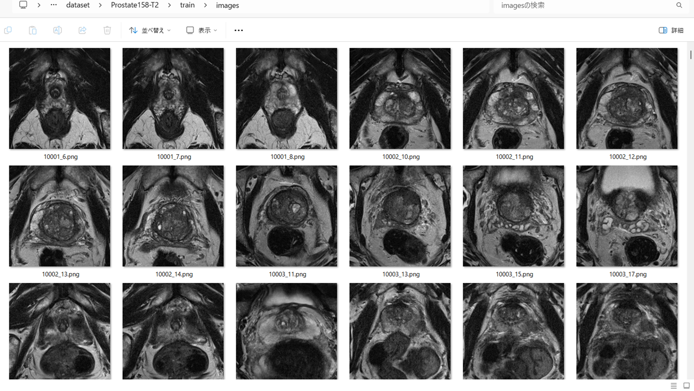
 
<b>Train_masks_sample</b> 
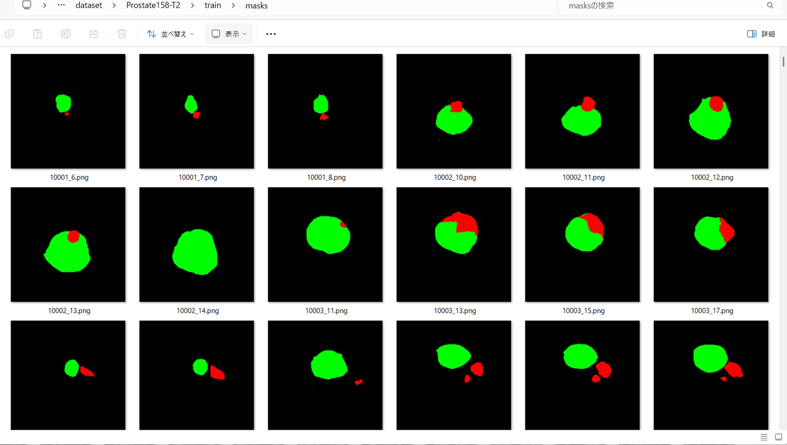
 

<h3>
3 Train TensorFlowFlexUNet Model
</h3>
 We trained Prostate158-T2 TensorFlowFlexUNet Model by using the 
<a href="./projects/TensorFlowFlexUNet/Prostate158-T2/train_eval_infer.config"> <b>train_eval_infer.config</b></a> file.  
Please move to ./projects/TensorFlowFlexUNet/Prostate158-T2, and run the following bat file. 
<pre>
>1.train.bat
</pre>
, which simply runs the following command. 
<pre>
>python ../../../src/TensorFlowFlexUNetTrainer.py ./train_eval_infer.config
</pre>

<b>Model parameters</b> 
Defined a small <b>base_filters = 16 </b> and large <b>base_kernels = (11,11)</b> for the first Conv Layer of Encoder Block of 
<a href="./src/TensorFlowFlexUNet.py">TensorFlowFlexUNet.py</a> 
and a large num_layers (including a bridge between Encoder and Decoder Blocks).
<pre>
[model]
;You may specify your own UNet class derived from our TensorFlowFlexModel
model         = "TensorFlowFlexUNet"
image_width    = 512
image_height   = 512
image_channels = 3
input_normalize = True
normalization  = False
num_classes    = 3
base_filters   = 16
base_kernels   = (11,11)
num_layers     = 8
dropout_rate   = 0.04
dilation       = (1,1)
</pre>
<b>Learning rate</b> 
Defined a small learning rate.  
<pre>
[model]
learning_rate  = 0.00007
</pre>
<b>Loss and metrics functions</b> 
Specified "categorical_crossentropy" and <a href="./src/dice_coef_multiclass.py">"dice_coef_multiclass"</a>. 
<pre>
[model]
loss           = "categorical_crossentropy"
metrics        = ["dice_coef_multiclass"]
</pre>
<b>Dataset class</b> 
Specifed <a href="./src/ImageCategorizedMaskDataset.py">ImageCategorizedMaskDataset</a> class. 
<pre>
[dataset]
class_name    = "ImageCategorizedMaskDataset"
</pre>
 
<b>Learning rate reducer callback</b> 
Enabled learing_rate_reducer callback, and a small reducer_patience.
<pre> 
[train]
learning_rate_reducer = True
reducer_factor     = 0.4
reducer_patience   = 4
</pre>
<b>Early stopping callback</b> 
Enabled early stopping callback with patience parameter.
<pre>
[train]
patience      = 10
</pre>
<b>RGB Color map</b> 
Specifed rgb color map dict for Prostate158-T2 1+2 classes. 
<pre>
[mask]
mask_datatyoe    = "categorized"
mask_file_format = ".png"
;Prostate158-T2 1+2 classes.
rgb_map = {(0,0,0):0, (0, 255, 0):1, (0,0,255):2}
</pre>
<b>Epoch change inference callback</b> 
Enabled <a href="./src/EpochChangeInferencer.py">epoch_change_infer callback</a></b>. 
<pre>
[train]
epoch_change_infer       = True
epoch_change_infer_dir   =  "./epoch_change_infer"
num_infer_images         = 6
</pre>
By using this callback, on every epoch_change, the inference procedure can be called
 for 6 images in <b>mini_test</b> folder. This will help you confirm how the predicted mask changes 
 at each epoch during your training process.  
  
As shown below, early in the model training, the predicted masks from our UNet segmentation model showed 
discouraging results.
 However, as training progressed through the epochs, the predictions gradually improved. 
   
 
<b>Epoch_change_inference output at starting (epoch 1,2,3)</b> 
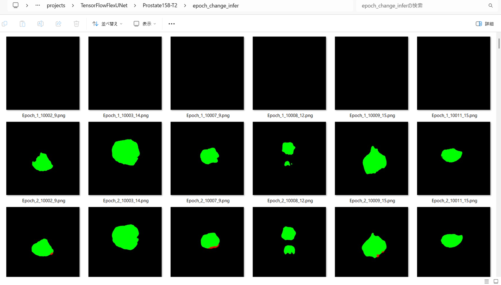 
 
<b>Epoch_change_inference output at middlepoint (epoch 31,32,33)</b> 
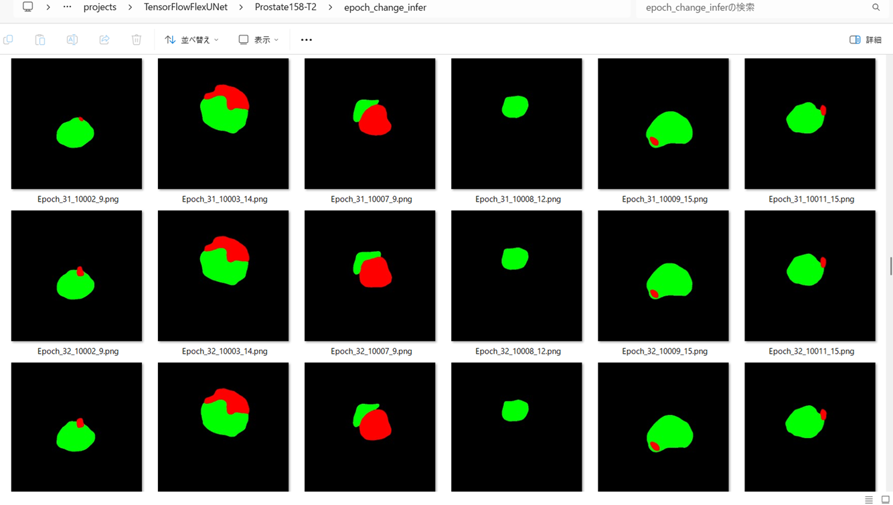 
 

<b>Epoch_change_inference output at ending (epoch 63,64,65)</b> 
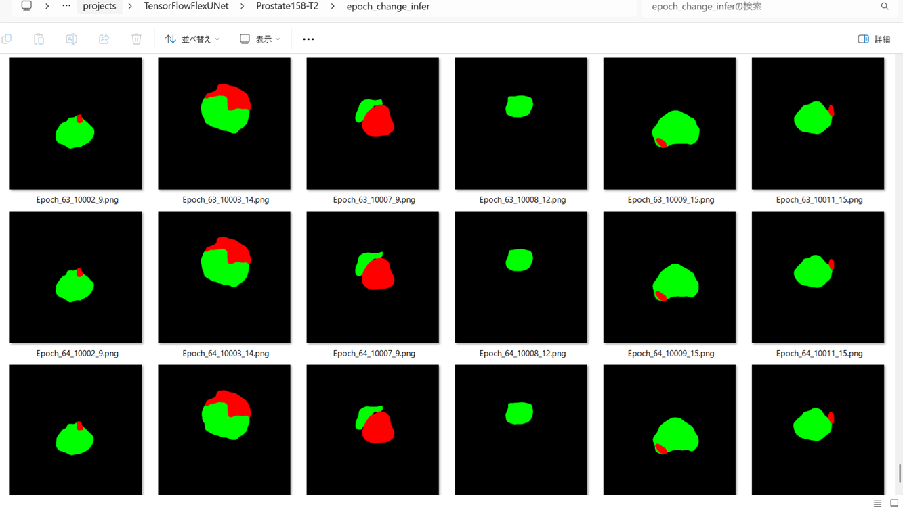 
 

In this experiment, the training process was stopped at epoch 65 by EarlyStopping callback.  
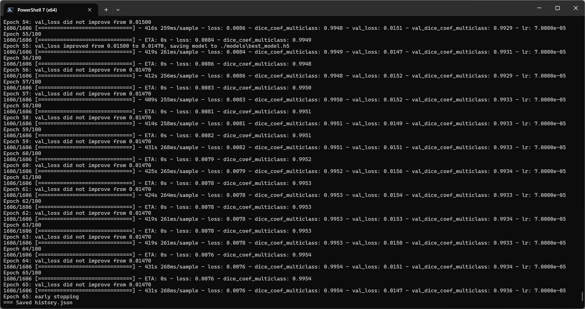 
 

<a href="./projects/TensorFlowFlexUNet/Prostate158-T2/eval/train_metrics.csv">train_metrics.csv</a> 
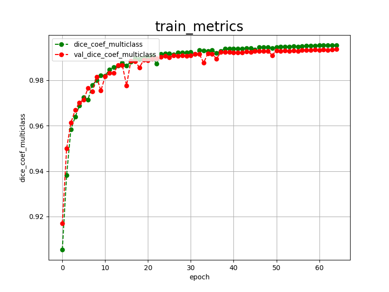 

 
<a href="./projects/TensorFlowFlexUNet/Prostate158-T2/eval/train_losses.csv">train_losses.csv</a> 
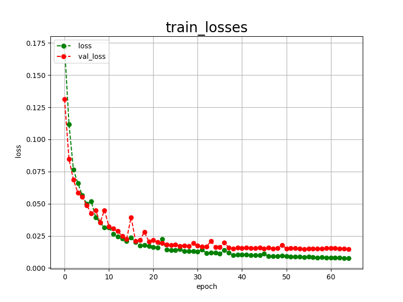 
 
<h3>
4 Evaluation
</h3>
Please move to <b>./projects/TensorFlowFlexUNet/Prostate158-T2</b> folder, 
and run the following bat file to evaluate TensorFlowUNet model for Prostate158-T2. 
<pre>
./2.evaluate.bat
</pre>
This bat file simply runs the following command.
<pre>
python ../../../src/TensorFlowFlexUNetEvaluator.py ./train_eval_infer_aug.config
</pre>

Evaluation console output: 
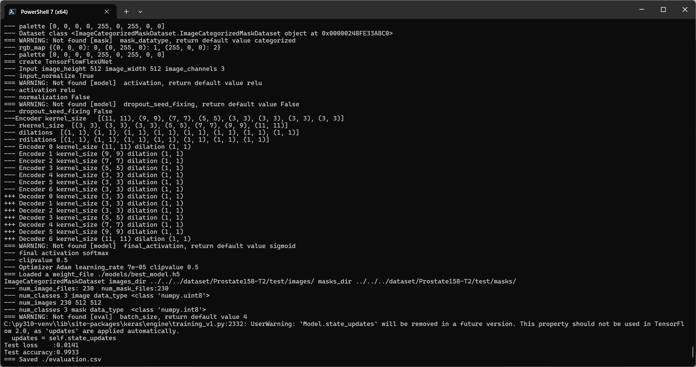
  Image-Segmentation-Prostate158-T2

<a href="./projects/TensorFlowFlexUNet/Prostate158-T2/evaluation.csv">evaluation.csv</a> 
The loss (categorical_crossentropy) to this <b>Prostate158-T2/test</b> was low and dice_coef_multiclass high as shown below.
 
<pre>
categorical_crossentropy,0.0141
dice_coef_multiclass,0.9933
</pre>
 
<h3>
5 Inference
</h3>
Please move to a <b>./projects/TensorFlowFlexUNet/Prostate158-T2</b> folder, and run the following bat file to infer segmentation regions for images by the Trained-TensorFlowUNet model for Prostate158-T2. 
<pre>
./3.infer.bat
</pre>
This simply runs the following command.
<pre>
python ../../../src/TensorFlowFlexUNetInferencer.py ./train_eval_infer_aug.config
</pre>

<b>mini_test_images</b> 
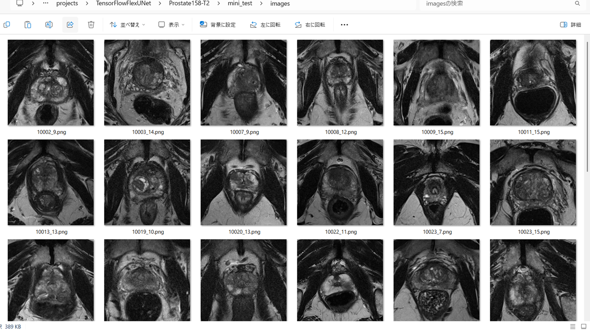 
<b>mini_test_mask(ground_truth)</b> 
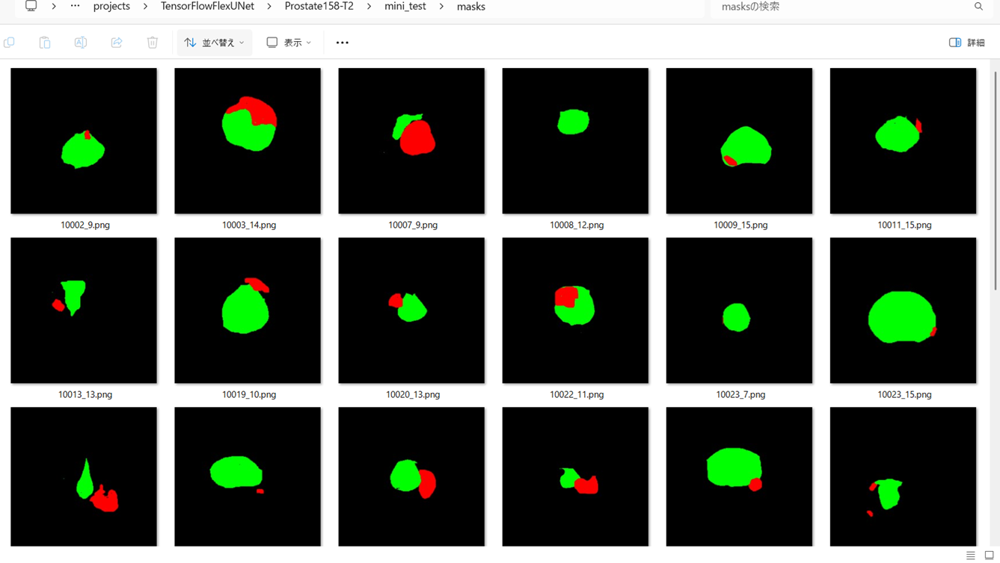 

<b>Inferred test masks</b> 
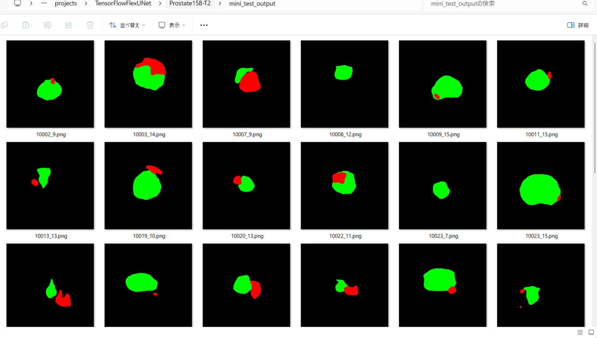 
 

<b>Enlarged images and masks of Prostate158-T2 Images</b> 
As shown below, the inferred masks predicted by our segmentation model trained by the dataset appear similar to the ground truth masks.
  
<b>rgb_map = {anatomical zone:green, tumor:red} </b>
  
<table>
<tr>
<th>Image</th>
<th>Mask (ground_truth)</th>
<th>Inferred-mask</th>
</tr>
<tr>
<td>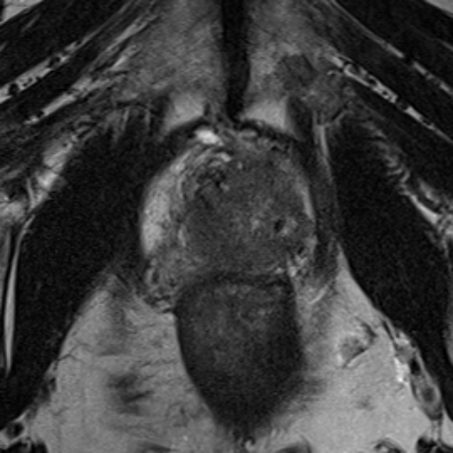</td>
<td>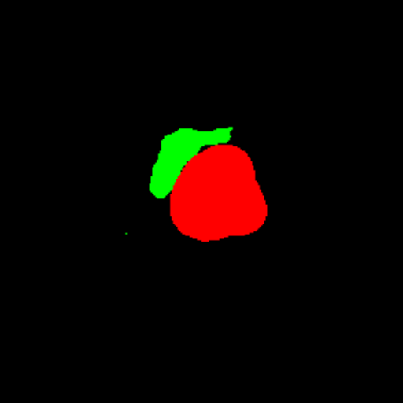</td>
<td>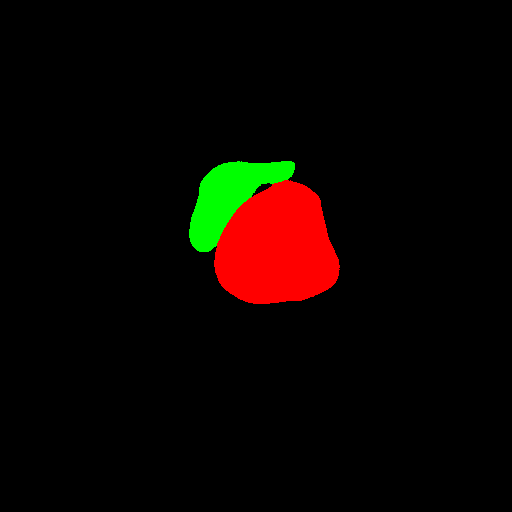</td>
</tr>

<tr>
<td>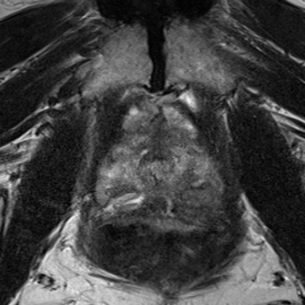</td>
<td>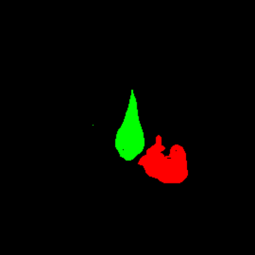</td>
<td>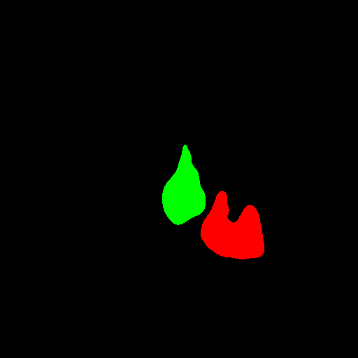</td>
</tr>

<tr>
<td>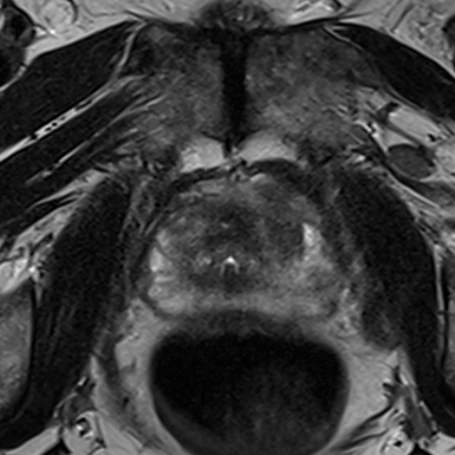</td>
<td>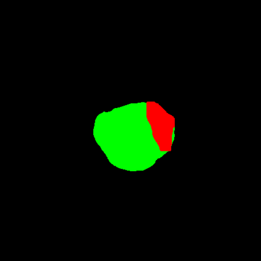</td>
<td>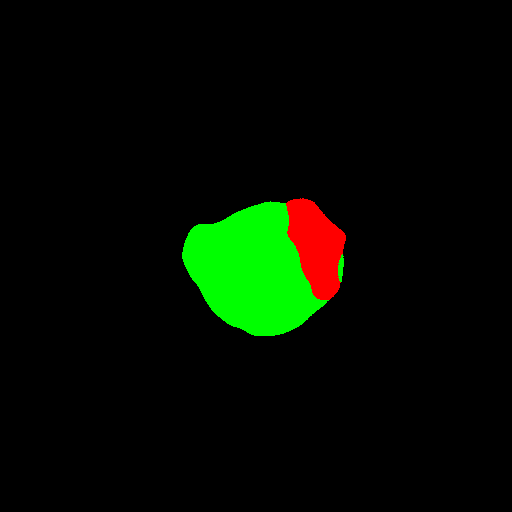</td>
</tr>

<tr>
<td></td>
<td></td>
<td></td>
</tr>

<tr>
<td>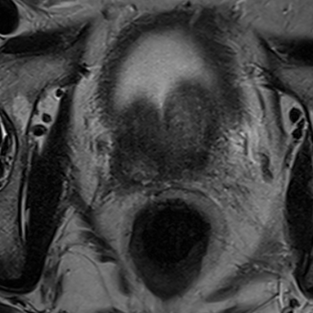</td>
<td>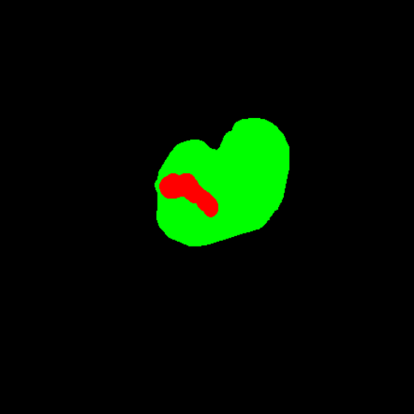</td>
<td></td>
</tr>

<tr>
<td>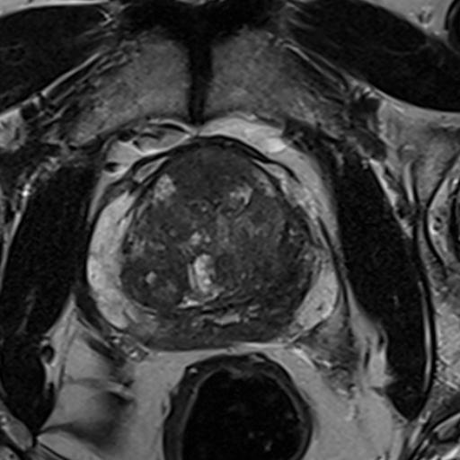</td>
<td>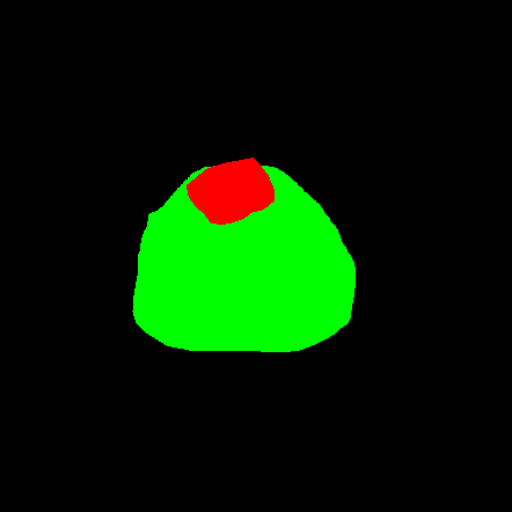</td>
<td>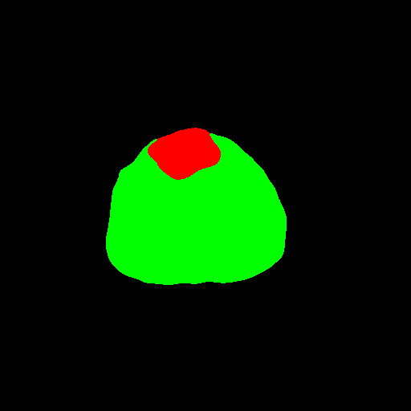</td>
</tr>
</table>

 
<h3>
References
</h3>
<b>1. Prostate158 - An expert-annotated 3T MRI dataset and algorithm for prostate cancer detection</b> 
Lisa C. Adams, Marcus R. Makowski, Günther Engel, Maximilian Rattunde, Felix Busch, Patrick Asbach,  
Stefan M. Niehues, Shankeeth Vinayahalingam, Bram van Ginneken, Geert Litjens, Keno K. Bressem 
<a href="https://www.sciencedirect.com/science/article/abs/pii/S0010482522005789">
https://www.sciencedirect.com/science/article/abs/pii/S0010482522005789
</a>
  
<b>2. Dataset of prostate MRI annotated for anatomical zones and cancer</b> 
Lisa C. Adams, Marcus R. Makowski, Günther Engel, Maximilian Rattunde, Felix Busch, Patrick Asbach, 
Stefan M. Niehues, Shankeeth Vinayahalingam, Bram van Ginneken, Geert Litjens, Keno K. Bressem 
<a href="https://pmc.ncbi.nlm.nih.gov/articles/PMC9679750/">
https://pmc.ncbi.nlm.nih.gov/articles/PMC9679750/
</a>
  
<b>3.Prostate158</b> 
<a href="https://github.com/kbressem/prostate158">https://github.com/kbressem/prostate158</a>
<  
<b>4. TensorFlow-FlexUNet-Image-Segmentation-Prostate-MRI</b> 
Toshiyuki Arai 
<a href="https://github.com/sarah-antillia/TensorFlow-FlexUNet-Image-Segmentation-Prostate-MRI">
https://github.com/sarah-antillia/TensorFlow-FlexUNet-Image-Segmentation-Prostate-MRI</a>
  
<b>5. TensorFlow-FlexUNet-Image-Segmentation-Model</b> 
Toshiyuki Arai 
<a href="https://github.com/sarah-antillia/TensorFlow-FlexUNet-Image-Segmentation-Model">
https://github.com/sarah-antillia/TensorFlow-FlexUNet-Image-Segmentation-Model</a>
  

